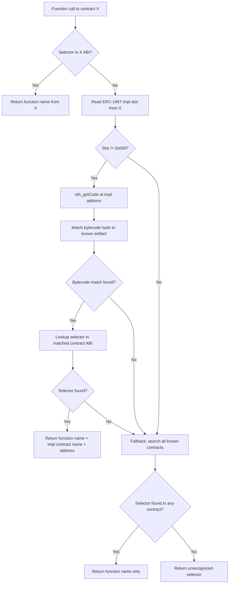

# EDR Enhancement: Proxy Contract Function Selector Resolution

## Issue Reference
- **Hardhat Issue**: [#7434](https://github.com/NomicFoundation/hardhat/issues/7434)
- **Summary**: When calling functions through proxy contracts, EDR console output shows `<unrecognized-selector>` even though the function is known from the implementation contract's ABI.

## Current Behavior

When a user calls a function through a proxy contract:

```
eth_call
  Contract call:             EIP173Proxy#<unrecognized-selector>
  From:                      0xd58445092375fba40716316df4735bdd0529b74e
  To:                        0x709e572c845544c0531fa423d2451e53fa04643d
```

## Expected Behavior

### With ERC-1967 Implementation Detection
When the proxy uses ERC-1967 standard slots and the implementation is found:

```
eth_call
  Contract call:             EIP173Proxy#transfer(address,uint256) (impl: MyToken @ 0xabc123...)
  From:                      0xd58445092375fba40716316df4735bdd0529b74e
  To:                        0x709e572c845544c0531fa423d2451e53fa04643d
```

### With Fallback Resolution
When ERC-1967 detection fails but the selector is found in other known contracts:

```
eth_call
  Contract call:             EIP173Proxy#transfer(address,uint256)
  From:                      0xd58445092375fba40716316df4735bdd0529b74e
  To:                        0x709e572c845544c0531fa423d2451e53fa04643d
```

**Note**: For fallback resolution, only show the method name without additional contract info.

---

## Technical Background

### ERC-1967 Storage Slots

ERC-1967 defines standardized storage slots for proxy contracts:

| Slot Name | Storage Slot | Derivation |
|-----------|--------------|------------|
| **Implementation** | `0x360894a13ba1a3210667c828492db98dca3e2076cc3735a920a3ca505d382bbc` | `keccak256("eip1967.proxy.implementation") - 1` |
| **Beacon** | `0xa3f0ad74e5423aebfd80d3ef4346578335a9a72aeaee59ff6cb3582b35133d50` | `keccak256("eip1967.proxy.beacon") - 1` |
| **Admin** | `0xb53127684a568b3173ae13b9f8a6016e243e63b6e8ee1178d6a717850b5d6103` | `keccak256("eip1967.proxy.admin") - 1` |

### Proxy Types This Fix Covers

| Proxy Type | Detection Method | Popularity |
|------------|------------------|------------|
| ERC-1967 Transparent Proxy | Implementation slot | Very common (OpenZeppelin) |
| ERC-1967 UUPS | Implementation slot | Common |
| ERC-1967 Beacon Proxy | Beacon slot → implementation | Less common |
| EIP-173 Proxy | Fallback only | Common |
| Custom Proxies | Fallback only | Varies |

---

## Implementation Algorithm

### Flow Diagram



### Pseudocode

```rust
// Storage slot constants
const ERC1967_IMPL_SLOT: [u8; 32] = hex!("360894a13ba1a3210667c828492db98dca3e2076cc3735a920a3ca505d382bbc");
const ERC1967_BEACON_SLOT: [u8; 32] = hex!("a3f0ad74e5423aebfd80d3ef4346578335a9a72aeaee59ff6cb3582b35133d50");

struct DecodedFunction {
    /// The function name (e.g., "transfer(address,uint256)")
    name: String,
    /// How the function was resolved (if not directly from called contract)
    resolved_from: Option<ResolvedFrom>,
}

enum ResolvedFrom {
    /// Resolved via ERC-1967 implementation slot
    Implementation { 
        contract_name: String, 
        address: Address 
    },
    /// Resolved via ERC-1967 beacon slot
    Beacon { 
        beacon_address: Address, 
        impl_address: Address, 
        contract_name: String 
    },
    /// Resolved via fallback search (no additional info needed for output)
    Fallback,
}

fn decode_function_selector(
    selector: [u8; 4],
    called_address: Address,
    called_contract: Option<&Contract>,
    bytecode_to_contract: &HashMap<BytecodeHash, Contract>,
    state: &dyn StateReader,  // Provides get_storage() and get_code()
) -> DecodedFunction {
    // =========================================================================
    // Step 1: Try to find selector in the called contract's ABI
    // =========================================================================
    if let Some(contract) = called_contract {
        if let Some(function) = contract.find_function_by_selector(selector) {
            return DecodedFunction {
                name: function.signature(),  // e.g., "transfer(address,uint256)"
                resolved_from: None,
            };
        }
    }
    
    // =========================================================================
    // Step 2: Try ERC-1967 implementation slot
    // Note: We don't check "is this a proxy" first - just read the slot.
    // If it's 0x000..., we fall through to fallback.
    // =========================================================================
    let impl_slot_value = state.get_storage(called_address, ERC1967_IMPL_SLOT);
    if impl_slot_value != [0u8; 32] {
        let impl_address = Address::from_slice(&impl_slot_value[12..32]);
        
        // Get bytecode at implementation address
        if let Some(impl_bytecode) = state.get_code(impl_address) {
            // Match bytecode to known artifact by hash
            let bytecode_hash = keccak256(&impl_bytecode);
            
            if let Some(impl_contract) = bytecode_to_contract.get(&bytecode_hash) {
                if let Some(function) = impl_contract.find_function_by_selector(selector) {
                    return DecodedFunction {
                        name: function.signature(),
                        resolved_from: Some(ResolvedFrom::Implementation {
                            contract_name: impl_contract.name.clone(),
                            address: impl_address,
                        }),
                    };
                }
            }
        }
    }
    
    // =========================================================================
    // Step 3: Try ERC-1967 beacon slot (optional enhancement)
    // =========================================================================
    let beacon_slot_value = state.get_storage(called_address, ERC1967_BEACON_SLOT);
    if beacon_slot_value != [0u8; 32] {
        let beacon_address = Address::from_slice(&beacon_slot_value[12..32]);
        
        // For beacon proxies, the beacon contract stores the implementation address
        // This could be:
        // - A storage slot in the beacon
        // - Calling beacon.implementation()
        // Implementation TBD based on what's most practical
    }
    
    // =========================================================================
    // Step 4: Fallback - search ALL known contracts for the selector
    // =========================================================================
    // Collect all unique function names that match this selector
    // (In practice, same selector = same function signature, but we handle
    // the theoretical case of selector collision)
    let mut function_names: HashSet<String> = HashSet::new();
    
    for contract in bytecode_to_contract.values() {
        if let Some(function) = contract.find_function_by_selector(selector) {
            function_names.insert(function.signature());
        }
    }
    
    if !function_names.is_empty() {
        let name = if function_names.len() == 1 {
            function_names.into_iter().next().unwrap()
        } else {
            // Extremely rare: selector collision, show all possible method names
            function_names.into_iter().collect::<Vec<_>>().join(" or ")
        };
        
        return DecodedFunction {
            name,
            resolved_from: Some(ResolvedFrom::Fallback),
        };
    }
    
    // =========================================================================
    // Step 5: Unable to resolve - return unrecognized
    // =========================================================================
    DecodedFunction {
        name: "<unrecognized-selector>".to_string(),
        resolved_from: None,
    }
}

// =========================================================================
// Output Formatting
// =========================================================================
fn format_contract_call(
    proxy_name: &str, 
    decoded: &DecodedFunction,
) -> String {
    match &decoded.resolved_from {
        // Direct match in called contract
        None => {
            format!("{}#{}", proxy_name, decoded.name)
        }
        // Resolved via ERC-1967 implementation slot
        Some(ResolvedFrom::Implementation { contract_name, address }) => {
            format!("{}#{} (impl: {} @ {:?})", 
                proxy_name, decoded.name, contract_name, address)
        }
        // Resolved via ERC-1967 beacon
        Some(ResolvedFrom::Beacon { contract_name, impl_address, .. }) => {
            format!("{}#{} (beacon impl: {} @ {:?})", 
                proxy_name, decoded.name, contract_name, impl_address)
        }
        // Fallback resolution - just show the method name
        Some(ResolvedFrom::Fallback) => {
            format!("{}#{}", proxy_name, decoded.name)
        }
    }
}
```

---

## Key Implementation Notes

### 1. Bytecode Matching
The implementation address from the ERC-1967 slot won't directly match any known artifact addresses (artifacts are identified by their bytecode, not deployment address). You need to:
1. Call `state.get_code(impl_address)` to get the bytecode
2. Compute `keccak256(bytecode)` to get the bytecode hash
3. Look up the hash in your artifact registry

**Note**: EDR likely already has this bytecode-to-artifact mapping for stack trace generation.

### 2. State Access
The function needs read access to chain state via:
- `get_storage(address, slot)` - to read ERC-1967 slots
- `get_code(address)` - to get implementation bytecode

This should be available during trace generation.

### 3. Performance Considerations
- Reading storage slots is fast (single trie lookup)
- Getting code is fast (already cached for execution)
- The fallback search should use a selector → function mapping built from all known ABIs for O(1) lookup

### 4. Edge Cases to Handle
| Edge Case | Handling |
|-----------|----------|
| Implementation slot is 0x000 | Fall through to fallback |
| Implementation bytecode not in artifacts | Fall through to fallback |
| Selector not found in implementation | Fall through to fallback |
| Selector collision (same 4 bytes, different functions) | Show all matching function names joined by " or " |
| Beacon proxy | Read beacon address, then read implementation from beacon |

---

## Files to Modify (Suggested)

The exact files depend on EDR's architecture, but likely candidates:

1. **Contract Decoder Module** - Where function selector resolution happens
2. **Trace Formatter/Logger** - Where the console output is generated
3. **Types** - Add `ResolvedFrom` enum and `DecodedFunction` struct

---

## Testing Strategy

### Unit Tests

1. **Direct match**: Selector found in called contract → no extra info
2. **ERC-1967 implementation**: Selector found via implementation slot → shows impl name + address
3. **Fallback single match**: Selector not in contract or ERC-1967, found in one other contract → shows method name only
4. **Fallback no match**: Selector not found anywhere → `<unrecognized-selector>`
5. **Zero implementation slot**: ERC-1967 slot is 0x000 → falls through to fallback
6. **Unknown implementation bytecode**: Implementation deployed but not in artifacts → falls through to fallback

### Integration Test Example

```solidity
// Implementation.sol
contract MyToken {
    function transfer(address to, uint256 amount) external returns (bool) {
        // ...
    }
}

// Proxy.sol (ERC-1967 compliant)
contract MyProxy {
    // Implementation slot: 0x360894...
    fallback() external {
        // delegate to implementation
    }
}
```

```typescript
// Test
const impl = await MyToken.deploy();
const proxy = await MyProxy.deploy(impl.address);

// Call through proxy
const proxiedToken = MyToken.attach(proxy.address);
await proxiedToken.transfer(recipient, 100);

// Verify console output shows:
// MyProxy#transfer(address,uint256) (impl: MyToken @ 0x...)
```

---

## Success Criteria

1. ✅ Proxy calls show the correct function name instead of `<unrecognized-selector>`
2. ✅ When resolved via ERC-1967, output includes implementation contract name and address
3. ✅ Fallback resolution shows just the method name
4. ✅ No regression in non-proxy contract calls
5. ✅ Performance impact is minimal
